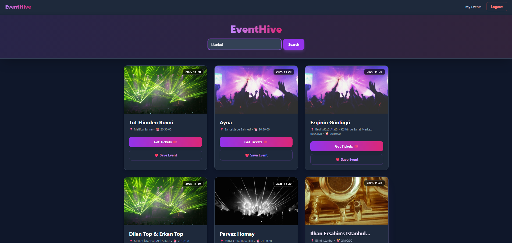

# 🐝 EventHive - Personalized Event Discovery Platform

EventHive is a full-stack web application that aggregates real-time events from around the world using the Ticketmaster API. It allows users to discover concerts, sports, and arts events, and features a secure authentication system for users to create accounts and manage a personal collection of saved events.


## 🚀 Features

* **Real-Time Event Aggregation:** Fetches live data from the Ticketmaster Discovery API with server-side filtering for expired events.
* **Dynamic Search:** Debounced search functionality allowing users to query events by city globally.
* **Secure Authentication:** JWT-based (JSON Web Tokens) login and registration system.
* **Personal Dashboard:** Protected routes allow authenticated users to save, view, and delete events from their personal database.
* **Modern UI/UX:** Built with React and Tailwind CSS, featuring dark mode, glassmorphism design, micro-interactions (Framer Motion), and toast notifications.

## 🛠️ Tech Stack

### Frontend
* **React (Vite):** Component-based UI architecture.
* **Tailwind CSS:** Utility-first styling for responsive design.
* **Framer Motion:** For smooth animations and page transitions.
* **React Hot Toast:** For non-intrusive notifications.
* **Axios:** For handling HTTP requests.

### Backend
* **Python (Flask):** RESTful API architecture.
* **SQLAlchemy:** ORM for database management.
* **Flask-JWT-Extended:** For secure, stateless authentication.
* **SQLite:** Local development database (scalable to PostgreSQL).

## ⚙️ Installation & Setup

### Prerequisites
* Node.js (v14+)
* Python (v3.8+)
* Ticketmaster API Key (Free)

### 1. Clone the Repository
```bash
git clone https://github.com/YOUR_USERNAME/EventHive.git
cd EventHive
```

### 2. Backend Setup
Navigate to the API folder and set up the Python environment:

```bash
cd eventhive-api
python -m venv venv

# Activate Virtual Environment:
# On Windows:
venv\Scripts\activate
# On macOS/Linux:
source venv/bin/activate

# Install Dependencies
pip install -r requirements.txt
```

**Environment Variables:**
Create a `.env` file in the `eventhive-api/` directory and add the following:

```ini
TICKETMASTER_API_KEY=your_ticketmaster_key_here
JWT_SECRET_KEY=your_super_secret_jwt_key
SECRET_KEY=your_flask_secret_key
DATABASE_URL=sqlite:///eventhive.db
```

**Run the Server:**
```bash
python app.py
```

### 3. Frontend Setup
Open a new terminal, navigate to the web folder, and install Node dependencies:

```bash
cd eventhive-web
npm install
npm run dev
```

## 🧠 Key Technical Decisions

* **Separation of Concerns:** The frontend handles presentation logic while the backend manages data hygiene and API proxying. This prevents exposing API keys to the client.
* **JWT vs Sessions:** Chosen JWT for stateless authentication, allowing for easier horizontal scaling in the future.
* **Optimistic UI:** The interface provides immediate feedback (loading skeletons, toast notifications) before the data fully settles, improving perceived performance.

## 📝 License
This project is open source and available under the [MIT License](LICENSE).
